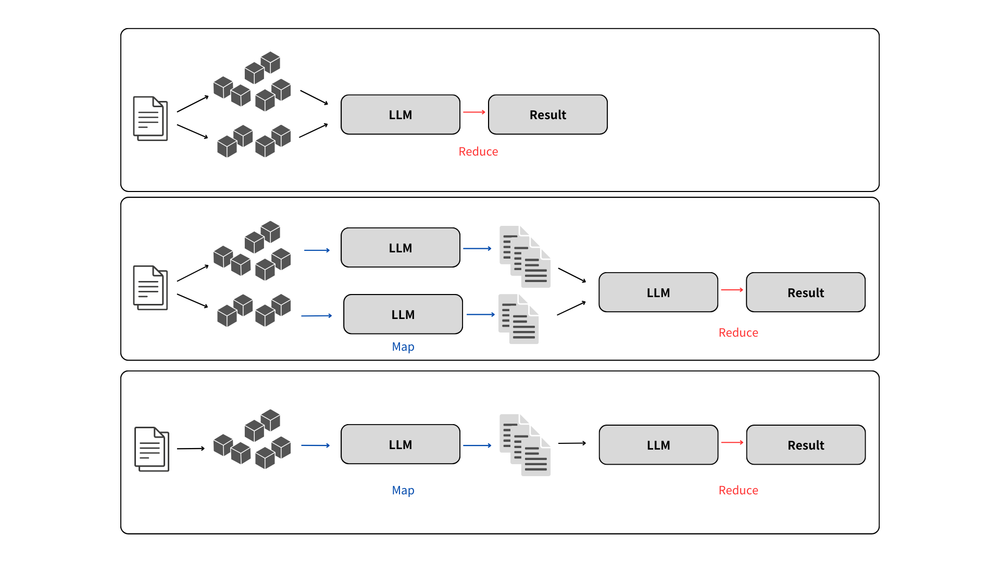
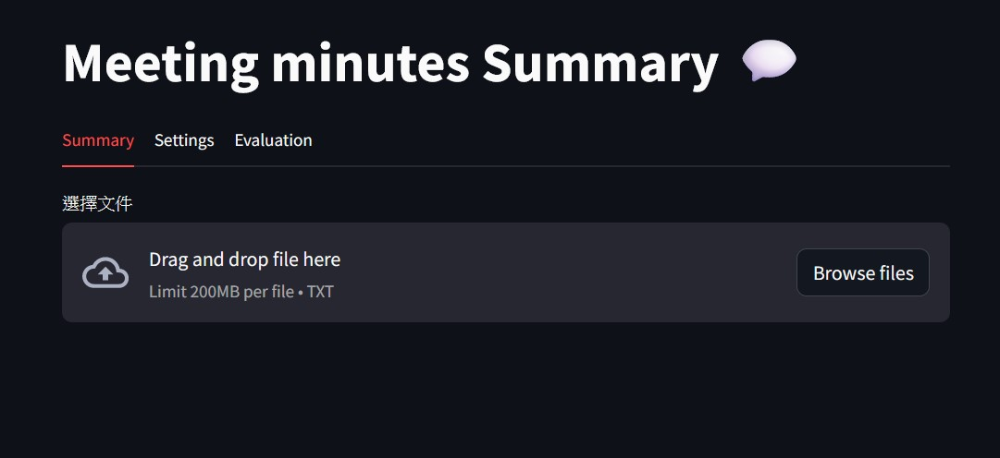
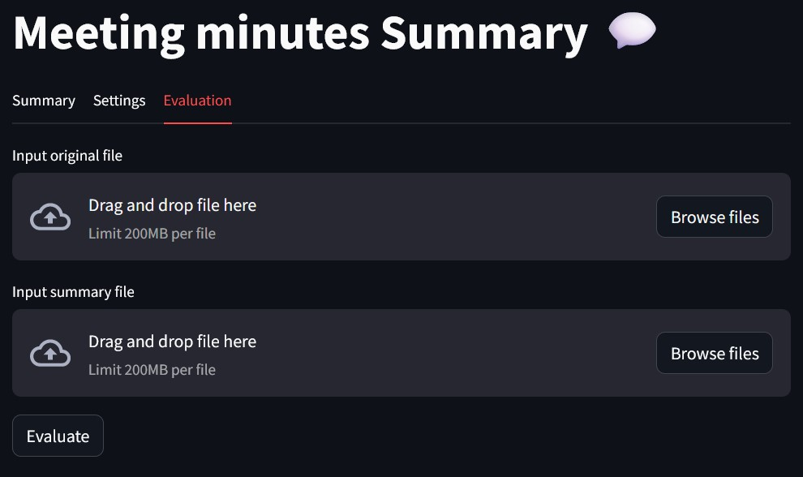
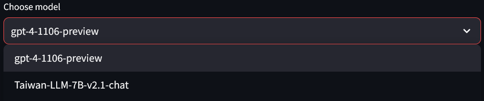

# MMSummary

In this project, three different methods can be used to extract article abstracts. 

For example, frist we cut the document using two different chunk sizes, merge the results into a single file, and then use the reduce chain for output.

Secondly, we use the file's map chain twice to extract each chunck's summary and then use the reduce chain to output.

Finally, we use the file's map chain once to extract the summary of the entire file and then use the reduce chain to output.


<!-- 插入圖片LLM.png -->



## Environment
Install requirements
```
conda create -n MMSummary python=3.10
conda activate MMSummary
pip install -r requirements.txt
```

create .env file in the directory
```
OPENAI_API_KEY=<Your_API_KEY>
```

## Prompt file

map_template and reduce_template is the prompt template file for the LLM.

## Run
```
streamlit run ./web.py
```



## Evaluation
Upload the original file and the summary file and click the evaluation button.


## Command-Line Interface
If you want to use cli, you can use the following command
```
python3 ./cli/cli.py \
    --key "" \ opai key
    --file <your file name> \
    --model "gpt-4-1106-preview" \
    --chunk_size_1 16000 \
    --chunk_overlap_1 0 \
    --chunk_size_2 8000 \
    --chunk_overlap_2 0 \
    --token_max 16000 \
    --temperature 0 \
    --without_map \
    --output_dir "./cli/output/"
```
## Command-Line Interface Evaluation
``` 
python3 ./cli/eval.py \
    --orginal_file file \
    --summary_file file2 \
    --output_dir result_file
```
## Use local model
If you want to use local model, you can use the following command.

#### 1. Fastchat server start
```
python -m fastchat.serve.controller --host 0.0.0.0
```
#### 2. Use FastChat as a local drop-in replacement for OpenAI APIs
```
python -m fastchat.serve.openai_api_server --host 0.0.0.0 --controller-address http://localhost:21001
```

#### 3. Use the local model as a model worker for the Fastchat server.

Here we use yentinglin/Taiwan-LLM-7B-v2.1-chat as an example, you can also replace it with another huggingface repo id or local model path. In addition, you can create multiple model workers to the Fastchat server.
```
python -m fastchat.serve.model_worker --model-path yentinglin/Taiwan-LLM-7B-v2.1-chat --controller-address http://localhost:21001 --host 0.0.0.0 --port 21002 --worker-address http://localhost:21002 --num-gpus 1 --max-gpu-memory 24Gib
```

#### 4. Fix the streamlit selectbox in web.py 114 line.
```
model=st.selectbox("Choose model",["gpt-4-1106-preview","Taiwan-LLM-7B-v2.1-chat","your_new_model_name"])
```

#### 5. Run web.py
So you can see the model you just added in the selectbox.

