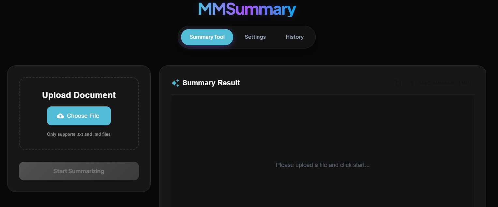

# MMSummary - Meeting Minutes Summarization Tool

[中文版 (Chinese Version)](./README_ZH.md)

MMSummary is a powerful, full-stack web application designed to automatically summarize long text documents, such as meeting minutes, transcripts, and comprehensive reports. Leveraging the power of Large Language Models (LLMs) and a Map-Reduce strategy, it can process extensive content that exceeds typical token limits, delivering concise and accurate summaries.



## Key Features

*   **Intelligent Text Summarization**:
    *   **Map-Reduce Architecture**: Effectively handles large documents by splitting them into manageable chunks ("Map" phase) and then synthesizing the results ("Reduce" phase).
    *   **Customizable Strategies**: Configure chunk sizes, overlaps, and token limits to fine-tune the summarization process for different document types.
    *   **Model Flexibility**: Support for various LLMs via OpenRouter and OpenAI (e.g., Google Gemma, GPT-4o).
*   **Custom Prompt Templates**:
    *   Full control over the summarization output by customizing the "Map" (chunk summary) and "Reduce" (final synthesis) prompts.
    *   Adjust `temperature` to control the creativity/determinism of the model.
*   **Multi-language Interface**:
    *   Switch between **English** and **Traditional Chinese** seamlessly via the settings menu.
*   **History & Persistence**:
    *   Automatically saves all summarization results to a MongoDB database.
    *   View, track, and delete past summaries, complete with processing metrics.
*   **Modern User Interface**:
    *   Clean, responsive frontend built with **React** and **Material-UI**.
    *   Easy file upload setup for `.txt` and `.md` files.
    *   Dedicated settings page for granular control over the AI parameters.
*   **Production Ready**:
    *   Containerized with **Docker** and orchestrated with **Kubernetes** for high availability and scalability.

## Technology Stack

### Backend
*   **Framework**: [FastAPI](https://fastapi.tiangolo.com/) - High-performance web framework for building APIs.
*   **AI Orchestration**: [LangChain](https://python.langchain.com/) - Framework for developing applications powered by language models.
*   **Database**: [MongoDB](https://www.mongodb.com/) - NoSQL database for flexible data storage.
*   **Runtime**: Python 3.10

### Frontend
*   **Framework**: [React](https://react.dev/) (via [Vite](https://vitejs.dev/))
*   **UI Library**: [Material-UI (MUI)](https://mui.com/) - Comprehensive suite of UI tools.
*   **Routing**: React Router
*   **HTTP Client**: Axios

### Infrastructure
*   **Containerization**: Docker
*   **Orchestration**: Kubernetes (K8s)
*   **CI/CD**: GitHub Actions

## CI/CD Pipeline

The project includes an automated CI/CD pipeline via GitHub Actions:
- **CI (ci.yml)**: Automatically runs on every Pull Request or push to `main`. It performs backend dependency checks, runs Python tests (pytest), and verifies that the frontend can build successfully.
- **CD (cd.yml)**: Triggers when a new version tag (e.g., `v1.0.0`) is pushed. It builds Docker images for both backend and frontend and pushes them to GitHub Container Registry (GHCR).

## Project Structure

```
MMSummary/
├── backend/            # FastAPI application
│   ├── api.py          # API endpoints and route logic
│   ├── core.py         # Core summarization logic (LangChain integration)
│   ├── database.py     # MongoDB connection and CRUD operations
│   ├── schemas.py      # Pydantic models for validation
│   └── Dockerfile      # Backend container definition
├── frontend/           # React application
│   ├── src/
│   │   ├── components/ # Reusable UI components
│   │   ├── pages/      # Page components
│   │   ├── translations.js # Multi-language translations
│   │   └── App.jsx     # Main entry point
│   ├── nginx.conf      # Frontend Nginx config (Reverse proxy)
│   └── Dockerfile      # Frontend container definition (Multi-stage)
├── k8s/                # Kubernetes manifests
│   ├── README.md       # K8s specific deployment guide
│   ├── deploy.yaml     # Namespace, Configs, and all Deployments (including MongoDB)
│   ├── services.yaml   # All Service definitions
│   ├── ingress.yaml    # Ingress routing configuration
│   └── secrets.yaml.example # Secrets template
├── template/           # Default prompt templates
├── requirements_backend.txt # Backend Python dependencies
└── README.md           # Project documentation
```

## Getting Started

### Prerequisites
*   Node.js (v20+)
*   Python (v3.10+)
*   MongoDB (Running locally, via Docker, or K8s deployment)
*   Docker & Kubernetes (Optional, for production deployment)

### 1. Backend Setup

1.  Create and activate a virtual environment:
    ```bash
    python -m venv venv
    # Windows
    .\venv\Scripts\activate
    # Mac/Linux
    source venv/bin/activate
    ```

2.  Install Python dependencies:
    ```bash
    pip install -r requirements_backend.txt
    ```

3.  Configure environment variables:
    Create a `.env` file in the root directory and add your API keys. If using a local MongoDB, ensure it is running:
    ```env
    OPENAI_API_KEY=your_openai_key
    OPENROUTER_API_KEY=your_openrouter_key
    MONGODB_URL=mongodb://localhost:27017
    ```

    > **Tip**: If you have Docker installed, you can quickly start a local MongoDB:
    > `docker run -d --name mongodb-local -p 27017:27017 mongo:latest`

4.  Start the Backend Server:
    ```bash
    python -m backend.api
    ```
    The API will be available at `http://localhost:8000`.

### 2. Frontend Setup

1.  Navigate to the frontend directory:
    ```bash
    cd frontend
    ```

2.  Install Javascript dependencies:
    ```bash
    npm install
    ```

3.  Start the Development Server:
    ```bash
    npm run dev
    ```
    Access the web interface at `http://localhost:5173`.

> **Note**: If you are deploying via **Kubernetes (Docker Desktop)**, access the app at **`http://localhost`** (default port 80).

## Production Deployment (Docker & K8s)

For production environments, we utilize Docker for containerization and Kubernetes for orchestration.

See the [Kubernetes Deployment Guide](./k8s/README.md) for detailed instructions on:
- Building container images.
- Configuring K8s Secrets and ConfigMaps.
- Deploying the full stack to a cluster.

## Usage Guide

1.  **Home / Summarize**:
    *   Upload a text file or paste text directly.
    *   Click "Start Summarize" to process the text.
2.  **Settings**:
    *   Adjust Language, Model type, Token limits, Chunk sizes, and Custom Prompts.
    *   Enable "Test Mode" to verify the flow without consuming API credits.
3.  **History**:
    *   View and management previously generated summaries.
