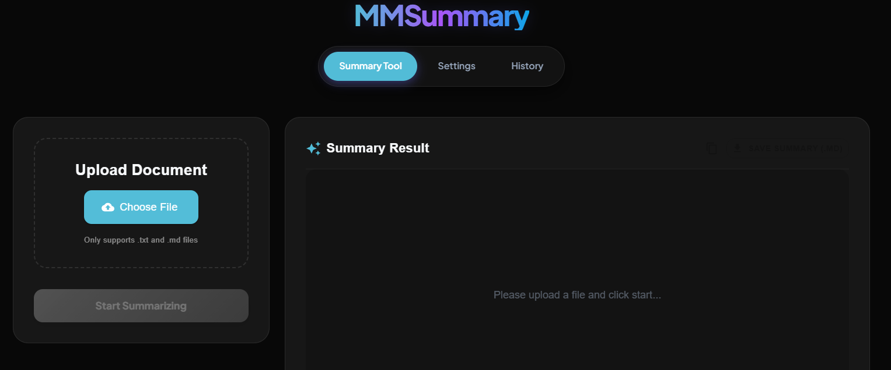

# MMSummary - 會議記錄摘要工具

[English Version](./README.md)

MMSummary 是一個強大的全端網頁應用程式，專為自動摘要長篇文本文件而設計，例如會議記錄、逐字稿和綜合報告。利用大型語言模型 (LLM) 的力量和 Map-Reduce 策略，它可以處理超過典型 Token 限制的大量內容，提供簡潔而準確的摘要。



## 主要功能

*   **智慧文本摘要**:
    *   **Map-Reduce 架構**: 通過將大文件分割成可管理的區塊（"Map" 階段），然後綜合結果（"Reduce" 階段），有效處理大型文件。
    *   **可自定義策略**: 設定區塊大小、重疊和 Token 限制，針對不同文件類型微調摘要過程。
    *   **模型靈活性**: 支援通過 OpenRouter 和 OpenAI 的各種 LLM（例如 Google Gemma, GPT-4o）。
*   **Agent 智能編排架構 (Agentic Orchestration)**:
    *   **Planner Agent**: 根據輸入文本長度動態決策最適合的處理策略 (如是否啟動 Map-Reduce、設定 chunk 大小)，以達到效能與成本的最佳平衡。
    *   **Reviewer Agent**: 針對生成的草稿進行自動化審查，檢查是否符合事實、避免幻覺 (Hallucination) 並攔截遺漏重點，若有瑕疵會自動重寫。
*   **自定義提示模板**:
    *   通過自定義 "Map"（區塊摘要）和 "Reduce"（最終合成）提示，完全控制摘要輸出。
    *   調整 `temperature` 以控制模型的創造性/確定性。
*   **多語系介面**:
    *   可在設定選單中輕鬆切換 **繁體中文** 與 **英文**。
*   **歷史記錄與持久化**:
    *   自動將所有摘要結果保存到 MongoDB 資料庫。
    *   查看、追蹤和刪除過去的摘要，包含處理指標。
*   **現代化使用者介面**:
    *   使用 **React** 和 **Material-UI** 建構的簡潔響應式前端。
    *   簡單的 `.txt` 和 `.md` 檔案上傳設定。
    *   專用的設定頁面，用於精細控制 AI 參數。
*   **雲端原生部署**:
    *   支援 **Docker** 容器化與 **Kubernetes (K8s)** 編排，具備高可用性與擴展性。

## API 版本

後端 FastAPI 應用程式目前版本為 **1.0.6**。

## 評估與消融實驗 (Ablation Study)

為驗證長文本處理策略的有效性，我們使用 MeetingBank 資料集的 6.5 萬字元會議記錄進行了消融實驗，結果顯示 **Agent Mode** 在品質上取得了最佳成績：
| 策略條件 | ROUGE-1 | ROUGE-L | 延遲 (秒) | 說明 |
| :--- | :--- | :--- | :--- | :--- |
| **Agent Mode (`auto_on`)** | **0.564** | **0.226** | 63.7s | **總冠軍**。Planner 動態規劃搭配 Reviewer 雙重把關，攔截幻覺並產出最高品質摘要，代價是處理時間較長。 |
| **Map-Reduce (`map_off`)** | 0.562 | 0.217 | 35.5s | 表現極佳且穩定。切塊處理能強制模型仔細閱讀細節。 |
| **直接輸入 (`direct_off`)** | 0.521 | 0.213 | 21.3s | 得益於現代語言模型極大的上下文視窗（如 128k），現在已可直接塞入完整長文本。它的表現甚至優於過去為了迴避上下文不足所提出的傳統 Map-Reduce 折疊方法。 |
| **傳統折疊 (`original_off`)**| 0.501 | 0.197 | 7.2s | 過去為了解決上下文不足所提出的傳統 LangChain 折疊 (Collapse) 策略，在現代大視窗模型面前反而效果不彰，且容易因內部邊界限制導致失敗。 |
| **無 Map 拼接 (`nomap_off`)** | 0.457 | 0.181 | 17.7s | 依賴單純字串拼接極易失敗或遺失脈絡。 |

## 技術堆疊

### 後端
*   **框架**: [FastAPI](https://fastapi.tiangolo.com/) - 用於構建 API 的高性能 Web 框架。
*   **AI 編排**: [LangChain](https://python.langchain.com/) - 用於開發由語言模型驅動的應用程式的框架。
*   **資料庫**: [MongoDB](https://www.mongodb.com/) - 用於靈活數據存儲的 NoSQL 資料庫。
*   **執行環境**: Python 3.10

### 前端
*   **框架**: [React](https://react.dev/) (via [Vite](https://vitejs.dev/))
*   **UI 庫**: [Material-UI (MUI)](https://mui.com/) - 綜合 UI 工具套件。
*   **路由**: React Router
*   **HTTP 客戶端**: Axios

### 基礎設施
*   **容器化**: Docker
*   **編排**: Kubernetes (K8s)
*   **CI/CD**: GitHub Actions

## CI/CD 流程

本專案透過 GitHub Actions 實現自動化 CI/CD：
- **CI (ci.yml)**：每當有 Pull Request 或推送至 `main` 分支時自動執行。負責檢查後端依賴、執行 Python 測試 (pytest)，並驗證前端是否能成功建構。
- **CD (cd.yml)**：當推送版本標籤（如 `v1.0.0`）時自動建構 Docker 映像檔並推送至 GitHub Container Registry (GHCR)。
- **文檔更新 (doc-update.yml)**：當變更推送至 `main` 或 `doc-update` 分支時，自動更新文檔，排除 `.github/docs-sync-needed/**` 路徑下的文件。

## 專案結構

```
MMSummary/
├── backend/            # FastAPI 應用程式
│   ├── api.py          # API端點和路由邏輯
│   ├── core.py         # 核心摘要邏輯 (LangChain 整合)
│   ├── database.py     # MongoDB 連接和 CRUD 操作
│   ├── schemas.py      # Pydantic 驗證模型
│   └── Dockerfile      # 後端容器定義
├── frontend/           # React 應用程式
│   ├── src/
│   │   ├── components/ # 可重用的 UI 組件
│   │   ├── pages/      # 頁面組件
│   │   ├── translations.js # 多語系翻譯
│   │   └── App.jsx     # 主要進入點
│   ├── nginx.conf      # 前端 Nginx 配置 (反向代理)
│   └── Dockerfile      # 前端容器定義 (多階段構建)
├── k8s/                # Kubernetes Manifests
│   ├── README.md       # K8s 專屬部署指南
│   ├── deploy.yaml     # 命名空間、配置與所有部署 (含 MongoDB)
│   ├── services.yaml   # 所有服務定義
│   ├── ingress.yaml    # Ingress 路由配置
│   └── secrets.yaml.example # 機密資訊範例
├── template/           # 預設提示模板
├── requirements_backend.txt # 後端 Python 依賴項
└── README.md           # 專案文檔
```

## 開始使用

### 先決條件
*   Node.js (v20+)
*   Python (v3.10+)
*   MongoDB (本地運行、使用 Docker 啟動或 K8s 部署)
*   Docker & Kubernetes (可選，用於生產環境部署)

### 1. 後端設定

1.  建立並啟用虛擬環境:
    ```bash
    python -m venv venv
    # Windows
    .\\venv\\Scripts\\activate
    # Mac/Linux
    source venv/bin/activate
    ```

2.  安裝 Python 依賴項:
    ```bash
    pip install -r requirements_backend.txt
    ```

3.  設定環境變數:
    在根目錄中創建一個 `.env` 文件並添加您的 API 金鑰。若使用本地 MongoDB，請確保它已啟動：
    ```env
    OPENAI_API_KEY=your_openai_key
    OPENROUTER_API_KEY=your_openrouter_key
    MONGODB_URL=mongodb://localhost:27017
    ```

    > **提示**：若電腦有 Docker，可快速啟動本地 MongoDB：
    > `docker run -d --name mongodb-local -p 27017:27017 mongo:latest`

4.  啟動後端伺服器:
    ```bash
    python -m backend.api
    ```
    API 將在 `http://localhost:8000` 上可用。

### 2. 前端設定

1.  導航到前端目錄:
    ```bash
    cd frontend
    ```

2.  安裝 Javascript 依賴項:
    ```bash
    npm install
    ```

3.  啟動開發伺服器:
    ```bash
    npm run dev
    ```
    在 `http://localhost:5173` 訪問 Web 介面。

> **注意**：如果您是使用 **Kubernetes (Docker Desktop)** 部署，請直接訪問 **`http://localhost`** (預設端口 80)。

## 生產環境部署 (Docker & K8s)

針對生產環境，我們使用 Docker 進行容器化，並透過 Kubernetes 進行自動化編排。

請參閱 [Kubernetes 部署指南](./k8s/README.md) 以獲取詳細指令：
- 如何構建容器映像檔。
- 如何配置 K8s Secrets 與 ConfigMaps。
- 如何將全端服務部署至叢集。

## 使用指南

1.  **首頁 / 摘要**:
    *   上傳文本文件或直接貼上文本。
    *   點擊 "開始摘要" 處理文本。
2.  **設定**:
    *   調整語系、模型類型、Token 限制、區塊大小與自定義提示。
    *   啟用 "測試模式" 以驗證流程而不消耗 API 額度。
3.  **歷史記錄**:
    *   查看與管理過往生成的摘要紀錄。